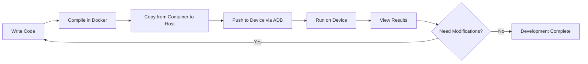

# Application Development Guide

English | [中文](APPLICATION_DEVELOPMENT.md)

This document describes how to develop user-level applications for AI Smart Glasses.

## 📋 Development Environment Preparation

Before starting development, ensure the following preparations are complete:

- ✅ Development environment set up according to [Docker Deployment Guide](DOCKER_DEPLOYMENT.en.md)
- ✅ Device connected to development host via USB
- ✅ ADB tool installed and can connect to device normally

### Verify Development Environment

```bash
# Verify Docker container running status
docker ps | grep rk1106_dev

# Verify ADB connection
adb devices

# Enter Docker development environment
docker exec -it rk1106_dev bash -l

# Verify cross-compilation toolchain
arm-rockchip831-linux-uclibcgnueabihf-gcc --version
```

## 🛠️ Cross-Compilation Toolchain

### Toolchain Information

- **Architecture**: ARM Cortex-A7
- **Toolchain Path**: `/opt/new/rv1106b_rv1103b_linux_ipc_v1.0.0_20241016/tools/linux/toolchain/arm-rockchip831-linux-uclibcgnueabihf`
- **Compiler**: `arm-rockchip831-linux-uclibcgnueabihf-gcc`
- **C++ Compiler**: `arm-rockchip831-linux-uclibcgnueabihf-g++`
- **Standard Library**: uClibc

### Common Tools

```bash
# C compiler
arm-rockchip831-linux-uclibcgnueabihf-gcc

# C++ compiler
arm-rockchip831-linux-uclibcgnueabihf-g++

# Linker
arm-rockchip831-linux-uclibcgnueabihf-ld

# Static library archiver
arm-rockchip831-linux-uclibcgnueabihf-ar

# View binary file information
arm-rockchip831-linux-uclibcgnueabihf-objdump

# View symbol table
arm-rockchip831-linux-uclibcgnueabihf-nm
```

## 🚀 Quick Start: Hello World

### Step 1: Create Project

```bash
# Enter Docker development environment
docker exec -it rk1106_dev bash -l

# Create project directory
mkdir -p /workspace/hello_world
cd /workspace/hello_world

# Create source file
cat > hello.c << 'EOF'
#include <stdio.h>

int main(int argc, char *argv[]) {
    printf("Hello from AI Smart Glasses!\n");
    printf("This is my first application.\n");
    return 0;
}
EOF
```

### Step 2: Compile Program

```bash
# Compile program
arm-rockchip831-linux-uclibcgnueabihf-gcc -o hello hello.c

# Verify compilation result
ls -lh hello
file hello
```

### Step 3: Deploy to Device

```bash
# Exit container
exit

# Copy from container to host
docker cp rk1106_dev:/workspace/hello_world/hello ./hello

# Push to device using ADB
adb push hello /userdata/hello

# Add execute permission and run on device
adb shell "chmod +x /userdata/hello && /userdata/hello"
```

**Expected Output**:
```
Hello from AI Smart Glasses!
This is my first application.
```

## 📝 Complete Development Workflow

### Workflow Diagram



### Detailed Steps

#### 1. Write Code

Recommended to use volume mount, write code on host:

```bash
# Run container with project directory mounted
docker run -it --name rk1106_dev \
  -v /path/to/your/project:/workspace \
  aiglasses/rk-rv1106b:ready bash -l
```

Or use vim/nano editor in container:

```bash
docker exec -it rk1106_dev bash -l
cd /workspace
vim myapp.c
```

#### 2. Compile Program

```bash
# Enter Docker environment
docker exec -it rk1106_dev bash -l

# Compile
cd /workspace
arm-rockchip831-linux-uclibcgnueabihf-gcc -o myapp myapp.c
```

#### 3. Copy to Host

```bash
# Execute on host
docker cp rk1106_dev:/workspace/myapp ./myapp
```

#### 4. Push to Device

```bash
# Push to device
adb push myapp /userdata/myapp
```

#### 5. Run on Device

```bash
# Method 1: Interactive run
adb shell
cd /userdata
chmod +x myapp
./myapp

# Method 2: One command run
adb shell "cd /userdata && chmod +x myapp && ./myapp"
```

## 💡 Compilation Options and Tips

### Basic Compilation Options

```bash
# Basic compilation
arm-rockchip831-linux-uclibcgnueabihf-gcc -o myapp myapp.c

# Enable optimization
arm-rockchip831-linux-uclibcgnueabihf-gcc -O2 -o myapp myapp.c

# Debug version (includes debug symbols)
arm-rockchip831-linux-uclibcgnueabihf-gcc -g -o myapp myapp.c

# Enable all warnings
arm-rockchip831-linux-uclibcgnueabihf-gcc -Wall -Wextra -o myapp myapp.c

# Static linking
arm-rockchip831-linux-uclibcgnueabihf-gcc -static -o myapp myapp.c
```

### Link Libraries

```bash
# Link math library
arm-rockchip831-linux-uclibcgnueabihf-gcc -o myapp myapp.c -lm

# Link thread library
arm-rockchip831-linux-uclibcgnueabihf-gcc -o myapp myapp.c -lpthread

# Link multiple libraries
arm-rockchip831-linux-uclibcgnueabihf-gcc -o myapp myapp.c -lpthread -lm -lrt

# Specify library path
arm-rockchip831-linux-uclibcgnueabihf-gcc -o myapp myapp.c -L/path/to/lib -lmylib
```

### Multi-File Compilation

```bash
# Compile multiple source files
arm-rockchip831-linux-uclibcgnueabihf-gcc -o myapp main.c util.c helper.c

# Step-by-step compilation
arm-rockchip831-linux-uclibcgnueabihf-gcc -c main.c
arm-rockchip831-linux-uclibcgnueabihf-gcc -c util.c
arm-rockchip831-linux-uclibcgnueabihf-gcc -o myapp main.o util.o
```

### Using Makefile

Create `Makefile`:

```makefile
CC = arm-rockchip831-linux-uclibcgnueabihf-gcc
CFLAGS = -Wall -O2
LDFLAGS = -lpthread -lm

TARGET = myapp
SRCS = main.c util.c helper.c
OBJS = $(SRCS:.c=.o)

all: $(TARGET)

$(TARGET): $(OBJS)
	$(CC) $(CFLAGS) -o $@ $^ $(LDFLAGS)

%.o: %.c
	$(CC) $(CFLAGS) -c $< -o $@

clean:
	rm -f $(OBJS) $(TARGET)

.PHONY: all clean
```

Compile:
```bash
make
```

## 📚 Common Application Examples

### Example 1: Read Sensor Data

```c
#include <stdio.h>
#include <stdlib.h>
#include <fcntl.h>
#include <unistd.h>

int main() {
    int fd;
    char buffer[256];

    // Open sensor device (example path)
    fd = open("/dev/sensor0", O_RDONLY);
    if (fd < 0) {
        perror("Failed to open sensor");
        return 1;
    }

    // Read data
    ssize_t bytes = read(fd, buffer, sizeof(buffer));
    if (bytes > 0) {
        printf("Sensor data: %s\n", buffer);
    }

    close(fd);
    return 0;
}
```

### Example 2: Multithreaded Application

```c
#include <stdio.h>
#include <pthread.h>
#include <unistd.h>

void* thread_function(void* arg) {
    int id = *(int*)arg;
    for (int i = 0; i < 5; i++) {
        printf("Thread %d: iteration %d\n", id, i);
        sleep(1);
    }
    return NULL;
}

int main() {
    pthread_t thread1, thread2;
    int id1 = 1, id2 = 2;

    pthread_create(&thread1, NULL, thread_function, &id1);
    pthread_create(&thread2, NULL, thread_function, &id2);

    pthread_join(thread1, NULL);
    pthread_join(thread2, NULL);

    printf("All threads completed\n");
    return 0;
}
```

Compile:
```bash
arm-rockchip831-linux-uclibcgnueabihf-gcc -o multithread multithread.c -lpthread
```

### Example 3: Network Communication

```c
#include <stdio.h>
#include <string.h>
#include <sys/socket.h>
#include <arpa/inet.h>
#include <unistd.h>

int main() {
    int sock;
    struct sockaddr_in server;
    char message[1024], response[2048];

    // Create socket
    sock = socket(AF_INET, SOCK_STREAM, 0);
    if (sock == -1) {
        printf("Could not create socket\n");
        return 1;
    }

    server.sin_addr.s_addr = inet_addr("192.168.1.100");
    server.sin_family = AF_INET;
    server.sin_port = htons(8080);

    // Connect to server
    if (connect(sock, (struct sockaddr*)&server, sizeof(server)) < 0) {
        perror("Connect failed");
        return 1;
    }

    printf("Connected to server\n");

    // Send data
    strcpy(message, "Hello from AI Glasses");
    if (send(sock, message, strlen(message), 0) < 0) {
        printf("Send failed\n");
        return 1;
    }

    // Receive response
    if (recv(sock, response, 2048, 0) < 0) {
        printf("Recv failed\n");
        return 1;
    }

    printf("Server reply: %s\n", response);
    close(sock);

    return 0;
}
```

## 🔍 Debugging Tips

### Using GDB for Debugging

```bash
# Compile with debug symbols
arm-rockchip831-linux-uclibcgnueabihf-gcc -g -o myapp myapp.c

# Use gdb on device (if installed)
adb shell
cd /userdata
gdb ./myapp
```

### View Log Output

```bash
# View program output in real-time
adb shell "cd /userdata && ./myapp" 2>&1 | tee app.log

# View system logs on device
adb shell
logcat | grep myapp
```

### Performance Analysis

```bash
# Use time command to measure execution time
adb shell "time /userdata/myapp"

# View process resource usage
adb shell "top -n 1 | grep myapp"
```

## 🛠️ Common Issues

### 1. Program Cannot Run: Permission Denied

**Problem**: `Permission denied`

**Solution**:
```bash
adb shell chmod +x /userdata/myapp
```

### 2. Shared Library Not Found

**Problem**: `error while loading shared libraries: xxx.so`

**Solutions**:
```bash
# Solution 1: Static linking
arm-rockchip831-linux-uclibcgnueabihf-gcc -static -o myapp myapp.c

# Solution 2: Push library files to device
adb push libxxx.so /usr/lib/

# Solution 3: Set LD_LIBRARY_PATH
adb shell "export LD_LIBRARY_PATH=/path/to/libs && ./myapp"
```

### 3. Cross-Compiled Program Segmentation Fault on Device

**Problem**: `Segmentation fault`

**Solutions**:
- Check if using correct toolchain
- Check for array out-of-bounds or null pointer access
- Compile with `-g` option, debug with gdb on device

### 4. ADB Cannot Connect to Device

**Problem**: `error: no devices/emulators found`

**Solutions**:
```bash
# Restart ADB service
adb kill-server
adb start-server

# Check device connection
adb devices

# Connect via IP (if network connection)
adb connect 192.168.1.100:5555
```

## 📂 Recommended Directory Structure

```
your-project/
├── src/              # Source code
│   ├── main.c
│   ├── utils.c
│   └── utils.h
├── include/          # Header files
│   └── config.h
├── build/            # Compilation output
│   └── myapp
├── libs/             # Third-party libraries
│   ├── libxxx.so
│   └── libxxx.a
├── Makefile          # Build script
└── README.md         # Project description
```

## 🚀 Advanced Topics

### Using System APIs

Refer to [API Reference Documentation](firmware/api-reference.md) for available system APIs.

### Accessing Hardware Resources

- Camera control
- Display output
- Audio playback and recording
- Sensor data reading
- WiFi/Bluetooth control

### Performance Optimization

- Use `-O2` or `-O3` optimization levels
- Reduce memory allocation
- Use multithreading to improve performance
- Avoid unnecessary system calls

## 📚 Related Documentation

- [Docker Deployment Guide](DOCKER_DEPLOYMENT.en.md) - Development environment setup
- [Firmware Flashing Guide](FIRMWARE_FLASHING.en.md) - Firmware flashing process
- [API Reference](firmware/api-reference.md) - System API documentation
- [Troubleshooting](troubleshooting/common-issues.md) - Common problem resolution

## 📞 Get Help

If you encounter development issues:
- 📖 Check the common issues section of this document
- 💬 Ask questions on [GitHub Issues](https://github.com/Iam5stillLearning/OpenSource-Ai-Glasses/issues)
- 📧 Send email to: iam5stilllearning@foxmail.com
- 💡 Check [Troubleshooting Documentation](troubleshooting/common-issues.md)

---

**Last Updated**: 2025-11-12 | **Version**: v1.0.0
