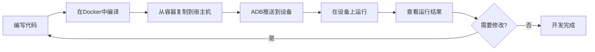

# 应用开发指南

[English](APPLICATION_DEVELOPMENT.en.md) | 中文

本文档介绍如何为 AI 智能眼镜开发用户级应用程序。

## 📋 开发环境准备

在开始开发之前，请确保已完成以下准备工作：

- ✅ 已按照 [Docker 部署指南](DOCKER_DEPLOYMENT.md) 搭建开发环境
- ✅ 设备已通过 USB 连接到开发主机
- ✅ ADB 工具已安装并可正常连接设备

### 验证开发环境

```bash
# 验证 Docker 容器运行状态
docker ps | grep rk1106_dev

# 验证 ADB 连接
adb devices

# 进入 Docker 开发环境
docker exec -it rk1106_dev bash -l

# 验证交叉编译工具链
arm-rockchip831-linux-uclibcgnueabihf-gcc --version
```

## 🛠️ 交叉编译工具链

### 工具链信息

- **架构**: ARM Cortex-A7
- **工具链路径**: `/opt/new/rv1106b_rv1103b_linux_ipc_v1.0.0_20241016/tools/linux/toolchain/arm-rockchip831-linux-uclibcgnueabihf`
- **编译器**: `arm-rockchip831-linux-uclibcgnueabihf-gcc`
- **C++ 编译器**: `arm-rockchip831-linux-uclibcgnueabihf-g++`
- **标准库**: uClibc

### 常用工具

```bash
# C 编译器
arm-rockchip831-linux-uclibcgnueabihf-gcc

# C++ 编译器
arm-rockchip831-linux-uclibcgnueabihf-g++

# 链接器
arm-rockchip831-linux-uclibcgnueabihf-ld

# 静态库归档工具
arm-rockchip831-linux-uclibcgnueabihf-ar

# 查看二进制文件信息
arm-rockchip831-linux-uclibcgnueabihf-objdump

# 查看符号表
arm-rockchip831-linux-uclibcgnueabihf-nm
```

## 🚀 快速入门：Hello World

### 第一步：创建项目

```bash
# 进入 Docker 开发环境
docker exec -it rk1106_dev bash -l

# 创建项目目录
mkdir -p /workspace/hello_world
cd /workspace/hello_world

# 创建源文件
cat > hello.c << 'EOF'
#include <stdio.h>

int main(int argc, char *argv[]) {
    printf("Hello from AI Smart Glasses!\n");
    printf("This is my first application.\n");
    return 0;
}
EOF
```

### 第二步：编译程序

```bash
# 编译程序
arm-rockchip831-linux-uclibcgnueabihf-gcc -o hello hello.c

# 验证编译结果
ls -lh hello
file hello
```

### 第三步：部署到设备

```bash
# 退出容器
exit

# 从容器复制到宿主机
docker cp rk1106_dev:/workspace/hello_world/hello ./hello

# 使用 ADB 推送到设备
adb push hello /userdata/apps/hello

# 在设备上添加执行权限并运行
adb shell "chmod +x /userdata/apps/hello && /userdata/apps/hello"
```

**预期输出**：
```
Hello from AI Smart Glasses!
This is my first application.
```

## 📝 完整开发流程

### 工作流程图



### 详细步骤

#### 1. 编写代码

推荐使用数据卷挂载方式，在宿主机编写代码：

```bash
# 运行容器时挂载项目目录
docker run -it --name rk1106_dev \
  -v /path/to/your/project:/workspace \
  aiglasses/rk-rv1106b:ready bash -l
```

或者在容器中使用 vim/nano 编辑器：

```bash
docker exec -it rk1106_dev bash -l
cd /workspace
vim myapp.c
```

#### 2. 编译程序

```bash
# 进入 Docker 环境
docker exec -it rk1106_dev bash -l

# 编译
cd /workspace
arm-rockchip831-linux-uclibcgnueabihf-gcc -o myapp myapp.c
```

#### 3. 复制到宿主机

```bash
# 在宿主机执行
docker cp rk1106_dev:/workspace/myapp ./myapp
```

#### 4. 推送到设备

```bash
# 推送到设备
adb push myapp /userdata/apps/myapp
```

#### 5. 在设备上运行

```bash
# 方式一：交互式运行
adb shell
cd /userdata/apps
chmod +x myapp
./myapp

# 方式二：一条命令运行
adb shell "cd /userdata/apps && chmod +x myapp && ./myapp"
```

## 💡 编译选项和技巧

### 基础编译选项

```bash
# 基础编译
arm-rockchip831-linux-uclibcgnueabihf-gcc -o myapp myapp.c

# 启用优化
arm-rockchip831-linux-uclibcgnueabihf-gcc -O2 -o myapp myapp.c

# 调试版本（包含调试符号）
arm-rockchip831-linux-uclibcgnueabihf-gcc -g -o myapp myapp.c

# 启用所有警告
arm-rockchip831-linux-uclibcgnueabihf-gcc -Wall -Wextra -o myapp myapp.c

# 静态链接
arm-rockchip831-linux-uclibcgnueabihf-gcc -static -o myapp myapp.c
```

### 链接库

```bash
# 链接数学库
arm-rockchip831-linux-uclibcgnueabihf-gcc -o myapp myapp.c -lm

# 链接线程库
arm-rockchip831-linux-uclibcgnueabihf-gcc -o myapp myapp.c -lpthread

# 链接多个库
arm-rockchip831-linux-uclibcgnueabihf-gcc -o myapp myapp.c -lpthread -lm -lrt

# 指定库路径
arm-rockchip831-linux-uclibcgnueabihf-gcc -o myapp myapp.c -L/path/to/lib -lmylib
```

### 多文件编译

```bash
# 编译多个源文件
arm-rockchip831-linux-uclibcgnueabihf-gcc -o myapp main.c util.c helper.c

# 分步编译
arm-rockchip831-linux-uclibcgnueabihf-gcc -c main.c
arm-rockchip831-linux-uclibcgnueabihf-gcc -c util.c
arm-rockchip831-linux-uclibcgnueabihf-gcc -o myapp main.o util.o
```

### 使用 Makefile

创建 `Makefile`:

```makefile
CC = arm-rockchip831-linux-uclibcgnueabihf-gcc
CFLAGS = -Wall -O2
LDFLAGS = -lpthread -lm

TARGET = myapp
SRCS = main.c util.c helper.c
OBJS = $(SRCS:.c=.o)

all: $(TARGET)

$(TARGET): $(OBJS)
	$(CC) $(CFLAGS) -o $@ $^ $(LDFLAGS)

%.o: %.c
	$(CC) $(CFLAGS) -c $< -o $@

clean:
	rm -f $(OBJS) $(TARGET)

.PHONY: all clean
```

编译：
```bash
make
```

## 📚 常见应用示例

### 示例 1：读取传感器数据

```c
#include <stdio.h>
#include <stdlib.h>
#include <fcntl.h>
#include <unistd.h>

int main() {
    int fd;
    char buffer[256];

    // 打开传感器设备（示例路径）
    fd = open("/dev/sensor0", O_RDONLY);
    if (fd < 0) {
        perror("Failed to open sensor");
        return 1;
    }

    // 读取数据
    ssize_t bytes = read(fd, buffer, sizeof(buffer));
    if (bytes > 0) {
        printf("Sensor data: %s\n", buffer);
    }

    close(fd);
    return 0;
}
```

### 示例 2：多线程应用

```c
#include <stdio.h>
#include <pthread.h>
#include <unistd.h>

void* thread_function(void* arg) {
    int id = *(int*)arg;
    for (int i = 0; i < 5; i++) {
        printf("Thread %d: iteration %d\n", id, i);
        sleep(1);
    }
    return NULL;
}

int main() {
    pthread_t thread1, thread2;
    int id1 = 1, id2 = 2;

    pthread_create(&thread1, NULL, thread_function, &id1);
    pthread_create(&thread2, NULL, thread_function, &id2);

    pthread_join(thread1, NULL);
    pthread_join(thread2, NULL);

    printf("All threads completed\n");
    return 0;
}
```

编译：
```bash
arm-rockchip831-linux-uclibcgnueabihf-gcc -o multithread multithread.c -lpthread
```

### 示例 3：网络通信

```c
#include <stdio.h>
#include <string.h>
#include <sys/socket.h>
#include <arpa/inet.h>
#include <unistd.h>

int main() {
    int sock;
    struct sockaddr_in server;
    char message[1024], response[2048];

    // 创建套接字
    sock = socket(AF_INET, SOCK_STREAM, 0);
    if (sock == -1) {
        printf("Could not create socket\n");
        return 1;
    }

    server.sin_addr.s_addr = inet_addr("192.168.1.100");
    server.sin_family = AF_INET;
    server.sin_port = htons(8080);

    // 连接到服务器
    if (connect(sock, (struct sockaddr*)&server, sizeof(server)) < 0) {
        perror("Connect failed");
        return 1;
    }

    printf("Connected to server\n");

    // 发送数据
    strcpy(message, "Hello from AI Glasses");
    if (send(sock, message, strlen(message), 0) < 0) {
        printf("Send failed\n");
        return 1;
    }

    // 接收响应
    if (recv(sock, response, 2048, 0) < 0) {
        printf("Recv failed\n");
        return 1;
    }

    printf("Server reply: %s\n", response);
    close(sock);

    return 0;
}
```

## 🔍 调试技巧

### 使用 GDB 调试

```bash
# 编译时包含调试符号
arm-rockchip831-linux-uclibcgnueabihf-gcc -g -o myapp myapp.c

# 在设备上使用 gdb（如果已安装）
adb shell
cd /userdata/apps
gdb ./myapp
```

### 查看日志输出

```bash
# 实时查看程序输出
adb shell "cd /userdata/apps && ./myapp" 2>&1 | tee app.log

# 在设备上查看系统日志
adb shell
logcat | grep myapp
```

### 性能分析

```bash
# 使用 time 命令测量执行时间
adb shell "time /userdata/apps/myapp"

# 查看进程资源使用
adb shell "top -n 1 | grep myapp"
```

## 🛠️ 常见问题

### 1. 程序无法运行：权限被拒绝

**问题**: `Permission denied`

**解决方案**:
```bash
adb shell chmod +x /userdata/apps/myapp
```

### 2. 找不到共享库

**问题**: `error while loading shared libraries: xxx.so`

**解决方案**:
```bash
# 方案1：静态链接
arm-rockchip831-linux-uclibcgnueabihf-gcc -static -o myapp myapp.c

# 方案2：将库文件推送到设备
adb push libxxx.so /usr/lib/

# 方案3：设置 LD_LIBRARY_PATH
adb shell "export LD_LIBRARY_PATH=/path/to/libs && ./myapp"
```

### 3. 交叉编译的程序在设备上段错误

**问题**: `Segmentation fault`

**解决方案**:
- 检查是否使用了正确的工具链
- 检查是否有数组越界或空指针访问
- 使用 `-g` 选项编译，在设备上用 gdb 调试

### 4. ADB 无法连接设备

**问题**: `error: no devices/emulators found`

**解决方案**:
```bash
# 重启 ADB 服务
adb kill-server
adb start-server

# 检查设备连接
adb devices

# 通过 IP 连接（如果是网络连接）
adb connect 192.168.1.100:5555
```

## 📂 推荐目录结构

```
your-project/
├── src/              # 源代码
│   ├── main.c
│   ├── utils.c
│   └── utils.h
├── include/          # 头文件
│   └── config.h
├── build/            # 编译输出
│   └── myapp
├── libs/             # 第三方库
│   ├── libxxx.so
│   └── libxxx.a
├── Makefile          # 构建脚本
└── README.md         # 项目说明
```

## 🚀 进阶主题

### 使用系统 API

参考 [API 参考文档](firmware/api-reference.md) 了解可用的系统 API。

### 访问硬件资源

- 摄像头控制
- 显示屏输出
- 音频播放和录制
- 传感器数据读取
- WiFi/蓝牙控制

### 性能优化

- 使用 `-O2` 或 `-O3` 优化级别
- 减少内存分配
- 使用多线程提高性能
- 避免不必要的系统调用

## 📚 相关文档

- [Docker 部署指南](DOCKER_DEPLOYMENT.md) - 开发环境搭建
- [固件烧录指南](FIRMWARE_FLASHING.md) - 固件烧录流程
- [API 参考](firmware/api-reference.md) - 系统 API 文档
- [故障排除](troubleshooting/common-issues.md) - 常见问题解决

## 📞 获取帮助

如果遇到开发问题：
- 📖 查阅本文档的常见问题部分
- 💬 在 [GitHub Issues](https://github.com/Iam5tillLearning/OpenSource-Ai-Glasses/issues) 提问
- 📧 发送邮件至: iam5stilllearning@foxmail.com
- 💡 查看 [故障排除文档](troubleshooting/common-issues.md)

---

**最后更新**: 2025-11-11 | **版本**: v1.0.0
