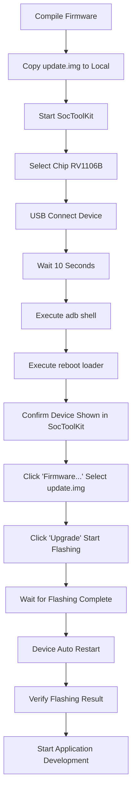

# Firmware Flashing Guide

English | [中文](FIRMWARE_FLASHING.md)

This document describes how to flash compiled firmware to AI Smart Glasses devices.

## ⚠️ Important Notice

> **Device Pre-installed Firmware**: Your AI Smart Glasses device usually comes with pre-installed factory firmware and **can be used directly**.
>
> **Only need to re-flash firmware in the following situations**:
> - 🔧 You have modified firmware code and need to test new features
> - 🐛 Need to fix system issues or upgrade system version
> - 🔄 Device system damaged and needs recovery
> - 🆕 Need to install specific version of firmware
>
> **If this is your first time using the device, we recommend referring to [Getting Started Guide](tutorials/beginner/getting-started.md) to start application development directly.**

## 📋 Prerequisites

### Hardware Requirements
- One AI Glasses developer sample (contact email to purchase)
- USB data cable (for connecting device and host)
- Development host (Windows/Linux)

### Software Requirements
- Compiled firmware file (update.img)
- SocToolKit flashing tool
- ADB tool (Android Debug Bridge)

## 🔧 Preparation

### 1. Get Firmware File

After firmware compilation completes, copy firmware from Docker container or local compilation environment to local machine:

#### Copy from Docker Container

```bash
# Copy firmware from container to host
docker cp rk1106_dev:/opt/aiglass_dev_env/output/image/update.img ./update.img
```

### 2. Prepare Flashing Tool

SocToolKit flashing tool is located in the project's `tools` directory, select the version for your operating system:

```
tools/
├── Windows/
│   └── SocToolKit/
│       └── SocToolKit.exe
└── Linux/
    └── SocToolKit/
        └── SocToolKit
```

## 📝 Flashing Steps

### Step 1: Start SocToolKit

Run the corresponding SocToolKit tool according to your operating system:

**Windows:**
```bash
tools/Windows/SocToolKit/SocToolKit.exe
```

**Linux:**
```bash
tools/Linux/SocToolKit/SocToolKit
```

### Step 2: Select Chip Model

In the SocToolKit interface:
1. Find the chip selection dropdown menu
2. Select **RV1106B** chip model

### Step 3: Connect Device

1. Use USB data cable to connect AI Smart Glasses to development host
2. Wait about **10 seconds** for system to recognize device

### Step 4: Enter Flashing Mode

1. Open terminal/command prompt window

2. Enter the following command to enter device interactive command line:
   ```bash
   adb shell
   ```

3. After successful connection, you'll see the device command line prompt

4. Enter the following command in device command line to enter flashing mode:
   ```bash
   reboot loader
   ```

5. Wait a few seconds, device will restart into loader mode

### Step 5: Confirm Device Connection

In the SocToolKit interface:
- Check **USB Device** area
- Confirm device is recognized and displayed in list
- Device status should show as flashable

### Step 6: Select Firmware File

1. Click **"Firmware..."** button in SocToolKit interface
2. In the file selection dialog that pops up, navigate to firmware directory
3. Select the **update.img** file you just compiled
4. Click **"Open"** to confirm selection

### Step 7: Start Flashing

1. Confirm firmware path is displayed correctly in interface
2. Click **"Upgrade"** button to start flashing
3. Wait for flashing progress bar to complete

During flashing:
- ⏳ Keep USB connection stable
- ⚠️ Do not disconnect device power
- ⚠️ Do not close SocToolKit tool
- 📊 Monitor progress bar and log information

### Step 8: Flashing Complete

1. When flashing progress reaches 100%, tool will prompt flashing success
2. Device will automatically restart
3. Wait for device to complete startup (about 10 seconds)

## ✅ Verify Flashing

### Method 1: Verify via ADB

```bash
# Connect device
adb shell

# Check device status
uname -a
```

### Method 2: Verify via Device Functions

1. Check if device display is normal
2. Check if camera function is normal
3. Check if audio function is normal
4. Check if network connection is normal

## 🔄 Complete Flashing Process Flow



## 🛠️ Common Issues

### 1. ADB Cannot Connect to Device

**Problem**: Prompt device not found when executing `adb shell`

**Solutions**:
```bash
# Check device connection
adb devices

# If no devices, try restarting adb service
adb kill-server
adb start-server

# Check devices again
adb devices
```

### 2. Device Not Entering Loader Mode

**Problem**: After executing `reboot loader`, device not shown in SocToolKit

**Solutions**:
- Check if USB connection is stable
- Try changing USB port
- Try changing USB data cable
- Wait longer (sometimes takes 30 seconds)
- Manually restart device and try again

### 3. SocToolKit Cannot Recognize Device

**Problem**: Device connected but SocToolKit not showing

**Solutions**:
- Confirm correct chip model selected (RV1106B)
- Check if USB driver installed correctly (Windows system)
- Try running SocToolKit with administrator privileges (Windows system)
- On Linux system check USB device permissions:
  ```bash
  # View USB devices
  lsusb

  # Add udev rules (if needed)
  sudo nano /etc/udev/rules.d/99-rockchip.rules
  ```

### 4. Flashing Process Interrupted

**Problem**: Flashing progress bar stuck or error reported

**Solutions**:
- Check if USB connection is stable
- Check if firmware file is complete (compare file size and MD5)
- Ensure sufficient disk space
- Recompile firmware and retry
- Try reducing USB transfer speed (in SocToolKit settings)

### 5. Device Cannot Boot After Flashing Complete

**Problem**: Flashing successful but device shows black screen or no response on boot

**Solutions**:
- Wait longer (first boot may take 2-3 minutes)
- Check if firmware matches hardware version
- Try re-flashing
- Check device hardware connections (battery, screen, etc.)
- View boot logs via serial port (if serial debug available)

### 6. Windows System Driver Issues

**Problem**: Windows system cannot recognize device

**Solutions**:
1. Download and install Rockchip USB driver
2. Check device status in Device Manager
3. Update or reinstall driver
4. Disable driver signature verification (for testing only)

### 7. Firmware Version Rollback

**Problem**: Need to flash old version firmware

**Solutions**:
- Use same flashing steps
- Select old version update.img file
- Backup current configuration before flashing (if needed)

## 💡 Best Practices

### Before Flashing
- ✅ Ensure firmware compilation has no errors
- ✅ Backup important data and configurations
- ✅ Fully charge device battery (at least 50%)
- ✅ Prepare stable USB connection environment
- ✅ Verify firmware file integrity

### During Flashing
- ✅ Keep computer and device power stable
- ✅ Do not move or touch device
- ✅ Monitor flashing log information
- ✅ Wait patiently for completion, do not interrupt

### After Flashing
- ✅ Verify device function integrity
- ✅ Record firmware version information
- ✅ Save flashing logs (if problems encountered)
- ✅ Test key function modules

## 🚀 Next Steps

After firmware flashing completes, you can:

1. **Develop Applications**
   - Refer to [Application Development Guide](APPLICATION_DEVELOPMENT.en.md)
   - Use cross-compilation toolchain to develop user-level applications
   - Deploy and debug programs via ADB

2. **Configure System**
   - Configure network connection
   - Set system parameters
   - Install necessary software packages

3. **Test & Verify**
   - Run test cases
   - Verify hardware functions
   - Performance testing

4. **Debug & Develop**
   - Log debugging via ADB
   - Program debugging using GDB
   - Performance analysis and optimization

## 📚 Related Documentation

- [Docker Deployment Guide](DOCKER_DEPLOYMENT.en.md) - Development environment setup
- [Application Development Guide](APPLICATION_DEVELOPMENT.en.md) - Application development getting started
- [Firmware Development Guide](firmware/getting-started.md) - Firmware development introduction
- [Troubleshooting](troubleshooting/common-issues.md) - Common problem resolution

## 📞 Get Help

If you encounter flashing issues:
- 📖 Check the common issues section of this document
- 💬 Ask questions on [GitHub Issues](https://github.com/Iam5stillLearning/OpenSource-Ai-Glasses/issues)
- 📧 Send email to: iam5stilllearning@foxmail.com
- 💡 Check [Troubleshooting Documentation](troubleshooting/common-issues.md)

---

**Last Updated**: 2025-11-12 | **Version**: v1.0.0
