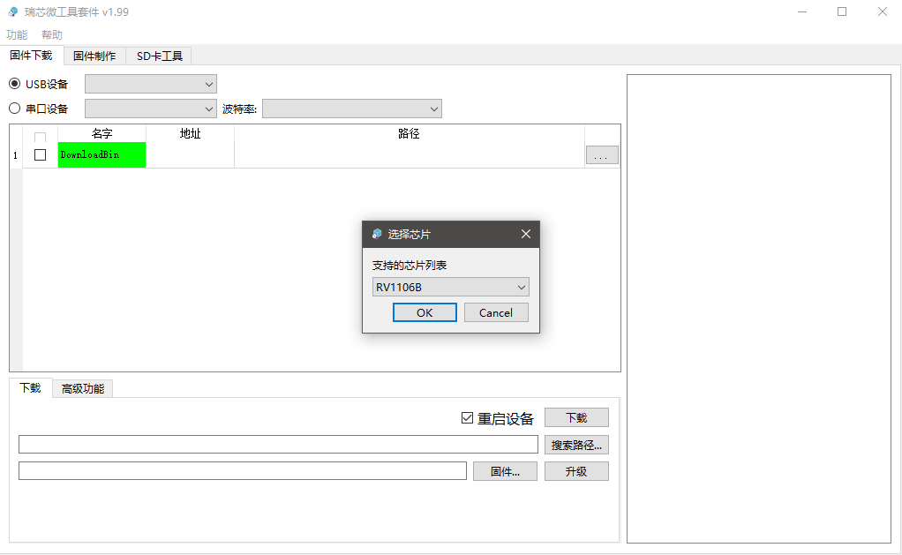
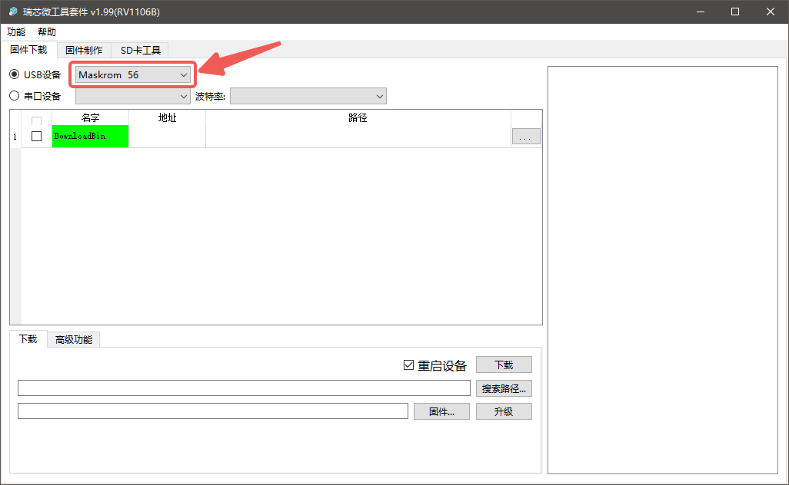
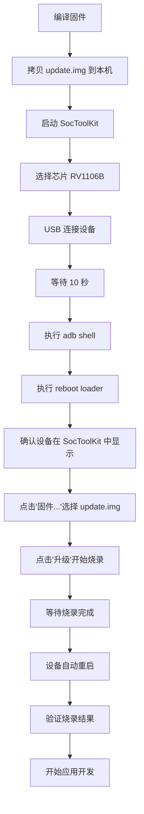

# 固件烧录指南

[English](FIRMWARE_FLASHING.en.md) | 中文

本文档介绍如何将编译好的固件烧录到 AI 智能眼镜设备中。

## ⚠️ 重要提示

> **设备已预装固件**: 您收到的 AI 智能眼镜设备通常已经预先烧录好了出厂固件，**可以直接使用**。
>
> **只有在以下情况下才需要重新烧录固件**:
> - 🔧 您修改了固件代码并需要测试新功能
> - 🐛 需要修复系统问题或升级系统版本
> - 🔄 设备系统损坏需要恢复
> - 🆕 需要安装特定版本的固件
>
> **如果您是首次使用设备，建议先参考 [快速入门指南](tutorials/beginner/getting-started.md) 直接开始应用开发。**

## 📋 前置要求

### 硬件要求
- AI眼镜开发者样机一台（购买请联系邮箱）
- USB 数据线（用于连接设备和主机）
- 开发主机（Windows/Linux）

### 软件要求
- 已编译的固件文件（update.img）
- SocToolKit 烧录工具
- ADB 工具（Android Debug Bridge）

## 🔧 准备工作

### 1. 获取固件文件

有两种方式可以获得固件：

- #### 从 Github 下载
   ```bash
   https://github.com/Iam5tillLearning/OpenSource-Ai-Glasses/releases
   ```

- #### 自行编译，从 Docker 容器拷贝

   ```bash
   # 从容器中拷贝固件到本机
   docker cp rk1106_dev:/opt/aiglass_dev_env/output/image/update.img ./update.img
   ```

### 2. 准备烧录工具

SocToolKit 烧录工具位于项目的 `tools` 目录下，根据你的操作系统选择对应版本：

```
tools/
├── Windows/
│   └── SocToolKit/
│       └── SocToolKit.exe
└── Linux/
    └── SocToolKit/
        └── SocToolKit
```

## 📝 烧录步骤

### 第一步：启动 SocToolKit

根据你的操作系统，运行对应的 SocToolKit 工具：

**Windows:**
```bash
tools/Windows/SocToolKit/SocToolKit.exe
```

**Linux:**
```bash
tools/Linux/SocToolKit/SocToolKit
```

### 第二步：选择芯片型号

在 SocToolKit 界面中：
1. 找到芯片选择下拉菜单
2. 选择 **RV1106B** 芯片型号


### 第三步：连接设备

1. 使用 USB 数据线将 AI 智能眼镜连接到开发主机
2. 等待约 **10 秒**，让系统识别设备

### 第四步：进入烧录模式

1. 打开终端/命令提示符窗口

2. 输入以下命令进入设备交互命令行：
   ```bash
   adb shell
   ```

3. 成功连接后，你会看到设备的命令行提示符

4. 在设备命令行中输入以下命令进入烧录模式：
   ```bash
   reboot loader
   ```

5. 等待几秒钟，设备将重启进入 loader 模式

### 第五步：确认设备连接

在 SocToolKit 界面中：
- 查看 **USB设备** 区域
- 确认设备已被识别并显示在列表中


### 第六步：选择固件文件

1. 在 SocToolKit 界面中点击 **"固件..."** 按钮
2. 在弹出的文件选择对话框中，导航到固件所在目录
3. 选择刚刚编译出来的 **update.img** 文件
4. 点击 **"打开"** 确认选择

### 第七步：开始烧录

1. 确认固件路径正确显示在界面中
2. 点击 **"升级"** 按钮开始烧录
3. 等待烧录进度条完成

烧录过程中：
- ⏳ 请保持 USB 连接稳定
- ⚠️ 不要断开设备电源
- ⚠️ 不要关闭 SocToolKit 工具
- 📊 观察进度条和日志信息

### 第八步：烧录完成

1. 当烧录进度达到 100% 时，工具会提示烧录成功
2. 设备将自动重启
3. 等待设备启动完成（约 10 秒）

## ✅ 验证烧录

### 方法一：通过 ADB 验证

```bash
# 连接设备
adb shell

# 查看设备状态
uname -a
```

### 方法二：通过设备功能验证

1. 检查设备显示是否正常
2. 检查摄像头功能是否正常
3. 检查音频功能是否正常
4. 检查网络连接是否正常

## 🔄 完整烧录流程图



## 🛠️ 常见问题

### 1. ADB 连接不上设备

**问题**: 执行 `adb shell` 时提示设备未找到

**解决方案**:
```bash
# 检查设备连接
adb devices

# 如果没有设备，尝试重启 adb 服务
adb kill-server
adb start-server

# 再次检查设备
adb devices
```

### 2. 设备未进入 loader 模式

**问题**: 执行 `reboot loader` 后，SocToolKit 中没有显示设备

**解决方案**:
- 检查 USB 连接是否稳定
- 尝试更换 USB 端口
- 尝试更换 USB 数据线
- 等待更长时间（有时需要 30 秒）
- 手动重启设备后再次尝试

### 3. SocToolKit 无法识别设备

**问题**: 设备已连接但 SocToolKit 不显示

**解决方案**:
- 确认已选择正确的芯片型号（RV1106B）
- 检查 USB 驱动是否正确安装（Windows 系统）
- 尝试以管理员权限运行 SocToolKit（Windows 系统）
- 在 Linux 系统上检查 USB 设备权限：
  ```bash
  # 查看 USB 设备
  lsusb

  # 添加 udev 规则（如需要）
  sudo nano /etc/udev/rules.d/99-rockchip.rules
  ```

### 4. 烧录过程中断

**问题**: 烧录进度条卡住或报错

**解决方案**:
- 检查 USB 连接是否稳定
- 检查固件文件是否完整（对比文件大小和 MD5）
- 确保磁盘空间充足
- 重新编译固件并重试
- 尝试降低 USB 传输速度（在 SocToolKit 设置中）

### 5. 烧录完成但设备无法启动

**问题**: 烧录成功但设备开机黑屏或无反应

**解决方案**:
- 等待更长时间（首次启动可能需要 2-3 分钟）
- 检查固件是否与硬件版本匹配
- 尝试重新烧录
- 检查设备硬件连接（电池、屏幕等）
- 通过串口查看启动日志（如有串口调试功能）

### 6. Windows 系统驱动问题

**问题**: Windows 系统无法识别设备

**解决方案**:
1. 下载并安装 Rockchip USB 驱动
2. 在设备管理器中检查设备状态
3. 更新或重新安装驱动程序
4. 禁用驱动签名验证（仅用于测试）

### 7. 固件版本回退

**问题**: 需要烧录旧版本固件

**解决方案**:
- 使用相同的烧录步骤
- 选择旧版本的 update.img 文件
- 烧录前备份当前配置（如有需要）

## 💡 最佳实践

### 烧录前
- ✅ 确保固件编译无错误
- ✅ 备份重要数据和配置
- ✅ 充满设备电池（至少 50%）
- ✅ 准备稳定的 USB 连接环境
- ✅ 验证固件文件的完整性

### 烧录中
- ✅ 保持电脑和设备电源稳定
- ✅ 不要移动或触碰设备
- ✅ 观察烧录日志信息
- ✅ 耐心等待完成，不要中断

### 烧录后
- ✅ 验证设备功能完整性
- ✅ 记录固件版本信息
- ✅ 保存烧录日志（如遇问题）
- ✅ 测试关键功能模块

## 🚀 下一步

固件烧录完成后，你可以：

1. **开发应用程序**
   - 参考 [应用开发指南](APPLICATION_DEVELOPMENT.md)
   - 使用交叉编译工具链开发用户级应用
   - 通过 ADB 部署和调试程序

2. **配置系统**
   - 配置网络连接
   - 设置系统参数
   - 安装必要的软件包

3. **测试验证**
   - 运行测试用例
   - 验证硬件功能
   - 性能测试

4. **调试开发**
   - 通过 ADB 进行日志调试
   - 使用 GDB 进行程序调试
   - 性能分析和优化

## 📚 相关文档

- [Docker 部署指南](DOCKER_DEPLOYMENT.md) - 开发环境搭建
- [应用开发指南](APPLICATION_DEVELOPMENT.md) - 应用程序开发入门
- [固件开发指南](firmware/getting-started.md) - 固件开发入门
- [故障排除](troubleshooting/common-issues.md) - 常见问题解决

## 📞 获取帮助

如果遇到烧录问题：
- 📖 查阅本文档的常见问题部分
- 💬 在 [GitHub Issues](https://github.com/Iam5stillLearning/OpenSource-Ai-Glasses/issues) 提问
- 📧 发送邮件至: iam5stilllearning@foxmail.com
- 💡 查看 [故障排除文档](troubleshooting/common-issues.md)

---

**最后更新**: 2025-11-11 | **版本**: v1.0.0
