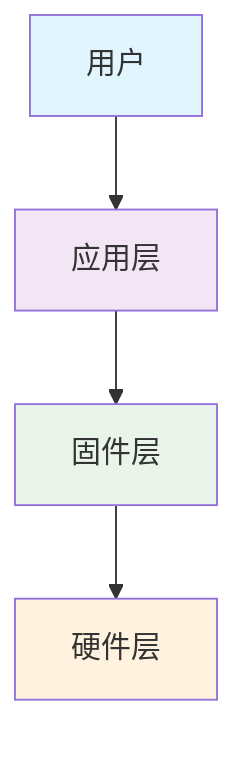

# [PROJECT_NAME]


[项目描述 - 1-2句话说明项目的主要功能和价值]

## ✨ 主要特性

- [特性1] - [简短描述]
- [特性2] - [简短描述]
- [特性3] - [简短描述]
- [特性4] - [简短描述]

## 🚀 快速开始

### 前置条件

- [要求1]
- [要求2]
- [要求3]

### 安装

```bash
# 步骤1
[命令]

# 步骤2
[命令]

# 步骤3
[命令]
```

### 基本使用

```bash
# 示例命令
[示例命令] --option

# 预期输出
[预期输出]
```

## 📋 硬件要求

| 项目 | 最低要求 | 推荐配置 |
|------|----------|----------|
| [组件1] | [要求] | [推荐] |
| [组件2] | [要求] | [推荐] |
| [组件3] | [要求] | [推荐] |

## 🏗️ 系统架构



## 📖 文档

- [用户手册](docs/user-guide.md) - 详细使用说明
- [开发者指南](docs/developer-guide.md) - 开发环境搭建
- [API文档](docs/api-reference.md) - 接口参考
- [故障排除](docs/troubleshooting.md) - 常见问题解决

## 🎯 应用场景

### [场景1]
[场景描述]

### [场景2]
[场景描述]

### [场景3]
[场景描述]

## 🤝 贡献

我们欢迎各种形式的贡献！请查看 [贡献指南](CONTRIBUTING.md) 了解详情。

### 贡献方式
- 🐛 报告Bug
- 💡 提出新功能建议
- 📝 改进文档
- 💻 提交代码

### 开发流程

1. Fork 本仓库
2. 创建特性分支 (`git checkout -b feature/AmazingFeature`)
3. 提交更改 (`git commit -m 'Add some AmazingFeature'`)
4. 推送到分支 (`git push origin feature/AmazingFeature`)
5. 创建 Pull Request

## 📄 许可证

本项目采用 [LICENSE_NAME](LICENSE) 许可证 - 查看 [LICENSE](LICENSE) 文件了解详情。

## 🙏 致谢

感谢以下项目和贡献者：
- [项目/贡献者1]
- [项目/贡献者2]
- [项目/贡献者3]

## 📞 联系我们

- **项目维护者**: [维护者姓名]
- **邮箱**: [邮箱地址]
- **项目主页**: [项目网址]
- **问题反馈**: [Issues链接]

## 🌟 Star History

[](https://star-history.com/#[USERNAME]/[PROJECT_NAME]&Date)

---

**注意**: [重要说明或注意事项]

---

*最后更新: [日期]*