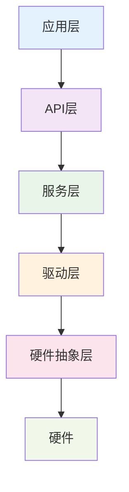

# [固件名称] 开发文档

**版本**: [固件版本]
**API版本**: [API版本]
**发布日期**: [发布日期]
**文档版本**: [文档版本]

## 📋 概述

[固件名称]是[硬件名称]的官方固件，提供[主要功能]。本文档介绍固件的架构、API接口、开发环境和使用方法。

### 系统架构



### 核心功能

- [功能1]: [功能描述]
- [功能2]: [功能描述]
- [功能3]: [功能描述]

## 🚀 快速开始

### 系统要求

- **操作系统**: [支持的操作系统]
- **开发工具**: [需要的开发工具]
- **硬件要求**: [开发硬件要求]
- **依赖项**: [依赖的库或工具]

### 安装步骤

```bash
# 1. 克隆仓库
git clone [仓库地址]
cd [项目目录]

# 2. 安装依赖
[安装命令]

# 3. 配置环境
[配置命令]

# 4. 编译固件
[编译命令]

# 5. 刷写固件
[刷写命令]
```

### 验证安装

```bash
# 检查固件版本
[检查命令]

# 运行测试
[测试命令]

# 预期输出
[预期输出]
```

## 🏗️ 系统架构

### 模块结构

```
firmware/
├── src/
│   ├── main.c              # 主程序入口
│   ├── drivers/            # 硬件驱动
│   ├── services/           # 核心服务
│   ├── api/               # API接口
│   └── utils/             # 工具函数
├── include/               # 头文件
├── config/                # 配置文件
├── tests/                 # 测试代码
└── docs/                  # 文档
```

### 主要模块

#### [模块1]
- **功能**: [模块功能]
- **接口**: [主要接口]
- **依赖**: [依赖关系]

#### [模块2]
- **功能**: [模块功能]
- **接口**: [主要接口]
- **依赖**: [依赖关系]

## 📡 API参考

### 初始化API

#### `int firmware_init(config_t *config)`
初始化固件系统。

**参数:**
- `config`: 配置结构体指针

**返回值:**
- `0`: 成功
- `-1`: 失败

**示例:**
```c
config_t config = {
    .log_level = LOG_INFO,
    .buffer_size = 1024
};

if (firmware_init(&config) != 0) {
    printf("初始化失败\n");
    return -1;
}
```

### 核心功能API

#### [API函数1]
```c
[函数签名]
```

**功能:** [功能描述]

**参数:**
- [参数1]: [参数描述]
- [参数2]: [参数描述]

**返回值:**
- [返回值描述]

**示例:**
```c
[示例代码]
```

#### [API函数2]
```c
[函数签名]
```

**功能:** [功能描述]

**参数:**
- [参数1]: [参数描述]
- [参数2]: [参数描述]

**返回值:**
- [返回值描述]

**示例:**
```c
[示例代码]
```

### 事件处理API

#### 事件注册
```c
int register_event_handler(event_type_t type, event_handler_t handler);
```

#### 事件发送
```c
int send_event(event_t *event);
```

### 配置API

#### 读取配置
```c
int read_config(const char *key, void *value, size_t size);
```

#### 写入配置
```c
int write_config(const char *key, const void *value, size_t size);
```

## 🔧 配置选项

### 配置文件格式

```json
{
  "system": {
    "log_level": "info",
    "buffer_size": 1024,
    "timeout": 5000
  },
  "hardware": {
    "cpu_freq": 1000000,
    "mem_size": 32768,
    "gpio_config": {
      "led_pin": 13,
      "button_pin": 2
    }
  },
  "network": {
    "wifi_ssid": "your_wifi",
    "wifi_password": "your_password",
    "server_url": "http://example.com/api"
  }
}
```

### 配置参数说明

| 参数 | 类型 | 默认值 | 说明 |
|------|------|--------|------|
| [参数1] | [类型] | [默认值] | [说明] |
| [参数2] | [类型] | [默认值] | [说明] |

## 🐛 调试指南

### 日志系统

#### 日志级别
- `LOG_ERROR`: 错误信息
- `LOG_WARN`: 警告信息
- `LOG_INFO`: 一般信息
- `LOG_DEBUG`: 调试信息

#### 日志函数
```c
// 设置日志级别
void set_log_level(log_level_t level);

// 输出日志
void log_printf(log_level_t level, const char *format, ...);
```

### 调试工具

#### 内存监控
```c
// 获取内存使用情况
memory_info_t get_memory_info(void);

// 检查内存泄漏
int check_memory_leak(void);
```

#### 性能监控
```c
// 开始性能监控
void start_perf_monitor(const char *name);

// 结束性能监控
void end_perf_monitor(const char *name);
```

### 常见问题

#### 问题1: [问题描述]
**症状:** [症状描述]
**原因:** [原因分析]
**解决:** [解决方法]

#### 问题2: [问题描述]
**症状:** [症状描述]
**原因:** [原因分析]
**解决:** [解决方法]

## 🧪 测试

### 单元测试

```bash
# 运行所有测试
make test

# 运行特定测试
make test TEST=[测试名称]

# 生成测试覆盖率报告
make coverage
```

### 集成测试

```bash
# 运行集成测试
make integration_test

# 硬件在环测试
make hils_test
```

### 性能测试

```bash
# 性能基准测试
make benchmark

# 内存泄漏测试
make leak_test
```

## 📦 构建和部署

### 构建选项

```bash
# 开发版本构建
make dev

# 生产版本构建
make release

# 调试版本构建
make debug

# 交叉编译
make cross PLATFORM=[平台]
```

### 部署流程

1. **准备硬件**
   - [准备步骤]
   - [检查项]

2. **刷写固件**
   - [刷写步骤]
   - [验证方法]

3. **配置验证**
   - [配置项]
   - [测试方法]

## 🔄 版本管理

### 版本号规则

版本号格式: `MAJOR.MINOR.PATCH`
- **MAJOR**: 重大变更，不兼容API修改
- **MINOR**: 功能增加，向后兼容
- **PATCH**: Bug修复，向后兼容

### 更新流程

1. 开发新功能
2. 测试验证
3. 版本号更新
4. 文档更新
5. 发布标记

## 📚 参考资料

- [硬件规格书](../hardware/specifications.md)
- [API完整文档](api-reference.md)
- [示例代码](../examples/)
- [社区论坛]([论坛地址])

## 🤝 贡献指南

欢迎贡献代码！请遵循以下步骤：

1. Fork 项目
2. 创建功能分支
3. 提交代码
4. 创建 Pull Request
5. 代码审查
6. 合并代码

## 📞 技术支持

- **问题反馈**: [Issues地址]
- **技术讨论**: [Discussions地址]
- **邮件联系**: [支持邮箱]

---

**文档信息**
- **维护者**: [维护者姓名]
- **创建日期**: [创建日期]
- **最后更新**: [更新日期]
- **文档版本**: [文档版本]

*本文档随固件版本更新而更新。*